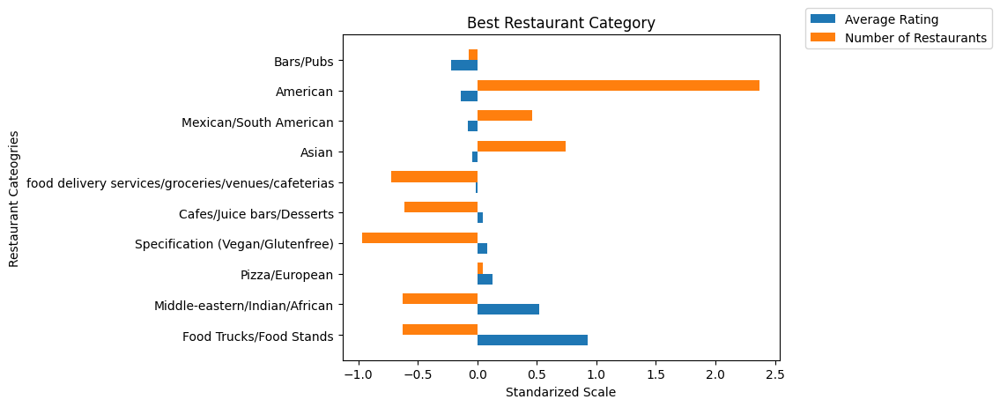
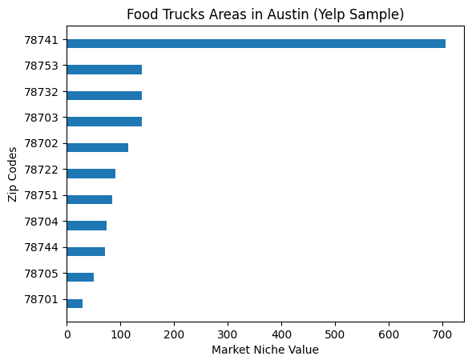

# How to Find Market Niche for your Business
## Introduction

Have you thought about using web scraping for your potential dish scraping business? If yes, this report would give you an applicable method to follow, which would pay off in the future. The goal of the project is to provide an insghit to potential investors in food & beverage industry. The idea here is to scrape Yelp resturants data, clean it, then analyze it by finding out which cusine has a market niche, and where it locates in Austin?

We don't recommend taking a decsison based on only these results since it requires deep-dive in market validation and market research. However, the analysis would be helpful for pleminary purposes.


## API Scraping

First of all, we extracted dataset data from Yelp website which was used for our methdology. Basically, we utilized [Yelp API documentation](https://www.yelp.com/developers/documentation/v3) to scrape resturants in Austin. We were able to extract restaurant details such as name, address, coordinates, rating, review count, restaurant category, price level and transaction types (pickup, delivery and/or restaurant reservation). Yelp has a cap of scrapped data from API, so we were only able to get results of 1000 different resturants in Austin city. However, we still think that's a big sample which could test our approach. 


## Data Cleaning

The API dataset needed to be cleaned and reformatted for analysis purposes. `Pandas` library was primarily used for data pre processing. First, we dropped records with missing price level data, so we could get a an overview of the average price per category. Second, to remove rating bias due to low number reviews, records with reviews count less than 10 were also dropped. This threshold of 10 was selected based on a review count CDF plot. 

The Yelp scraped dataset included 124 different categories for restaurants. That was a lot! So, these were aggregated into 10 broader groups to analyze which category would be best to invest in. Then, we used coding magic to seperate (strip) Zipcodes from address data, and latitude and longitude values from cooridinate information. In addition, transaction types were separated to indivdual columns with binary values for each unique type.

Also, ratings and review counts were standarized using by z-scoring to have them within the same scale for the anlatical part. Finally, we converted the price level from `$` to numbers from 1-4 for averaging analysis.


## Analysis

### Which Category is Best?
We analyzed the resturants by their category in order to get the averages of `price level`, `review count`, `rating`, `Rating_stndized`, and the number of resturants per category. Then we plotted the most intresting results which is the average rating, and the number of resturants by category. Since we are looking for the best invesment opportunities in terms of market niche, we would be intrested in the category with the highest average rating and lowest number of resturants. In this case, the investor could get an idea about the gap between the supply and demand. We believe based on our data, that would be a good plimenery result to identify the gap. However, investors should take that with a grain of salt. 

As we can see from the graph below, the market is saturated with `American`, `Mexican/South American`, and `Asian`. However, by looking at the `Food Truck/Food Stands` and `Middle Eastern/Indian/African` categories, we can see good opportunites there in terms of lack of number of resturants, and their high reviews which reflects the prefrence of the consumers. For the sake of this project we decided to deep-dive into the `Food Truck/Food Stands` category.





### What Zip Code is optimal?
For this section, we had look into the zip codes of the `Food Truck/Food Stands` to find which zip codes have the highest customer engagments using Yelp reviewers. We believe this a good method to use since it could give the investor an insight where customers have higher probability to write a comment in Yelp for your restaurant which the investor could leverage on. 

Since some of the Food Truks are located within the same zip codes, we had to group them by the zip code and finding the average review counts, number of food trucks in each zip code, and average rating with a zip code.

In order to build a statstical measure for market niche, we created a statstical ratio for that. So basically, we multiplied the average rating by the average number of reviews within a zip code, then divide that by the number of restaurants to penalize the ratio. The idea here is to inflate the number of the average review counts if you have good reviews, and discount it by the number of food trucks to be able to find market niche.

```Market Niche = (Average Number of Reviews by the Zip Code * Average Rating by the Zip Code)/Number of Restaurants ```

We found out that `78741` is the highest by far. One reason is because there is an HEB market in this ZIP Code, with an elementary school which reflects a neighborhood with certain purchasing power.




### Key Takeaways
So this analysis would be great to explore potential restaurant categories in the food and beverage sector. We leveraged our skills in scraping to explore the data in Austin. Then we cleaned it, and analyze it accordingly. This analysis would be helpful to be included in the market validation study within the food and beverage sector. 